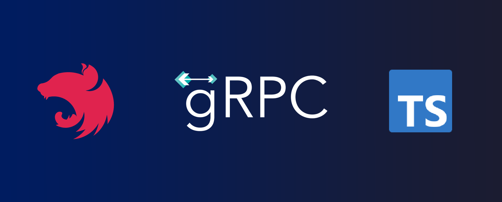

# Node.js Nest.js TypeScript GRPC application boilerplate with best practices.



The main purpose of this repository is to show a good end-to-end Grpc project setup and workflow for writing a Node.js Nest.js code in TypeScript.

# Why TypeScript?

While it's true that developing applications on an Untyped language such as **JavaScript**, is easier to learn and is faster to develop, it will undeniably get harder and harder to grasp as the application grows in scale. This in turn, leads to more run-time errors consuming more development hours, as the team gets accustomed to the growing codebase. And this is what this boilerplate hopes to achieve. By using the **TypeScript** standard and **Nest.js**, you'll have better team and code stability with **Interface Oriented Development**, leading to better standardized codes. TypeScript allows developers to focus more on exposed Interfaces or API, rather than having to know all the code by heart. This makes the codebase easier to maintain with big teams, especially if those teams are composed of developers of different skill levels.

# Prerequisites

To build and run this app locally you will need a few things:

- Install [Node.js](https://nodejs.org/en/)
- Install [VS Code](https://code.visualstudio.com/)

# Getting started

- Clone the repository

```
git clone --depth=1 https://github.com/SamanNsr/nest-grpc-boilerplate.git <project_name>
```

- Install dependencies

```
cd <project_name>
npm install
npm run dev
```

- Build and run the project

```
npm run build
npm run start:prod
```

Finally, navigate to `0.0.0.0:3000` and you should see the API running!

## Project Structure

The most obvious difference in a TypeScript + Node project is the folder structure. In a TypeScript project, it's best to have separate _source_ and _distributable_ files. TypeScript (`.ts`) files live in your `src` folder and after compilation are output as JavaScript (`.js`) in the `dist` folder.

The full folder structure of this app is explained below:

> **Note!** Make sure you have already built the app using `npm run start`

| Name               | Description                                                                                                                                                   |
| ------------------ | ------------------------------------------------------------------------------------------------------------------------------------------------------------- |
| **dist**           | Contains the distributable (or output) from your TypeScript build                                                                                             |
| **node_modules**   | Contains all your npm dependencies                                                                                                                            |
| **REST**           | Contains all API requests to test the routes, used with [REST Client VSCode extension](https://marketplace.visualstudio.com/items?itemName=humao.rest-client) |
| **src**            | Contains your source code that will be compiled to the dist dir                                                                                               |
| **src/config**     | Contains config environment to be used by the config package.                                                                                                 |
| **src/common**     | Contains common and shared modules                                                                                                                            |
| **src/core**       | Contains core modules of your application                                                                                                                     |
| **src/externals**  | Contain external services modules for external communications                                                                                                 |
| **src/interfaces** | Contain ts interfaces of your app                                                                                                                             |
| **src/plugins**    | Contain plugins that you want to use                                                                                                                          |
| **src/providers**  | Contain your application providers such as mongo, redis or any external provider                                                                              |
| **src/utils**      | Contain your applications utilities                                                                                                                           |
| **src/grpc-client.ts**  | Contain your grpc app config                                                                                                                             |
| **src/main.ts**    | Entry point to your app                                                                                                                                       |
| package.json       | File that contains npm dependencies as well as [build scripts](#what-if-a-library-isnt-on-definitelytyped)                                                    |
| tsconfig.json      | Config settings for compiling server code written in TypeScript                                                                                               |
| .eslintrc.js       | Config settings for lint code style checking                                                                                                                  |


| `compilerOptions`            | Description                                                                                                                                                |
| ---------------------------- | ---------------------------------------------------------------------------------------------------------------------------------------------------------- |
| `"module": "commonjs"`       | The **output** module type (in your `.js` files). Node uses commonjs, so that is what we use                                                               |
| `"esModuleInterop": true,`   | Allows usage of an alternate module import syntax: `import foo from 'foo';`                                                                                |
| `"target": "es6"`            | The output language level. Node supports ES6, so we can target that here                                                                                   |
| `"noImplicitAny": true`      | Enables a stricter setting which throws errors when something has a default `any` value                                                                    |
| `"moduleResolution": "node"` | TypeScript attempts to mimic Node's module resolution strategy. Read more [here](https://www.typescriptlang.org/docs/handbook/module-resolution.html#node) |
| `"sourceMap": true`          | We want source maps to be output along side our JavaScript. See the [debugging](#debugging) section                                                        |
| `"outDir": "dist"`           | Location to output `.js` files after compilation                                                                                                           |
| `"baseUrl": "."`             | Part of configuring module resolution. See [path mapping section](#installing-dts-files-from-definitelytyped)                                              |
| `paths: {...}`               | Part of configuring module resolution. See [path mapping section](#installing-dts-files-from-definitelytyped)                                              |

`include` takes an array of glob patterns of files to include in the compilation. This project is fairly simple and all of our .ts files are under the `src` folder.

### VSCode Extensions

To enhance your development experience while working in VSCode, I provided you with a list of suggested extensions while working on this project:

- [REST Client](https://marketplace.visualstudio.com/items?itemName=humao.rest-client)
- [Version Lens](https://marketplace.visualstudio.com/items?itemName=pflannery.vscode-versionlens)
- [Prettier - Code formatter](https://marketplace.visualstudio.com/items?itemName=esbenp.prettier-vscode)
- [Bracket Pair Colorizer](https://marketplace.visualstudio.com/items?itemName=CoenraadS.bracket-pair-colorizer)
- [index-rainbow](https://marketplace.visualstudio.com/items?itemName=oderwat.indent-rainbow)
- [Material Icon Theme](https://marketplace.visualstudio.com/items?itemName=PKief.material-icon-theme)

# Dependencies

Dependencies are managed through `package.json`.
In that file you'll find two sections:

